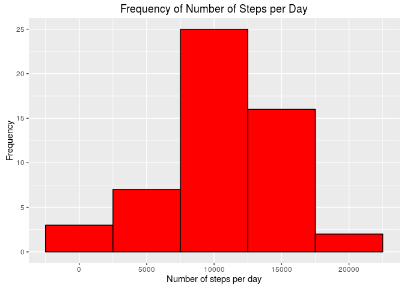
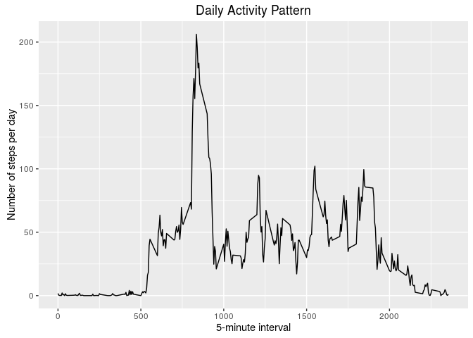
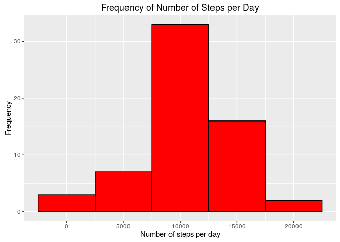
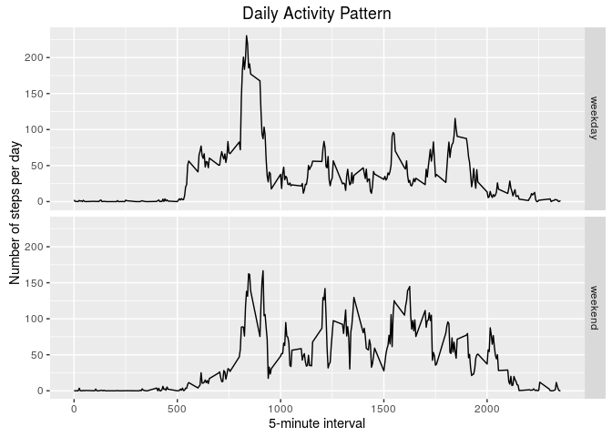

# Reproducible Research: Peer Assessment 1


## Loading and preprocessing the data


```r
library(ggplot2);library(plyr)
unzip(zipfile = "activity.zip", exdir = ".", unzip = "internal")
df <- read.csv("activity.csv", header = TRUE, sep = ",", na.strings = "NA")
df$date <- as.Date(df$date, "%Y-%m-%d")
str(df)
```

```
## 'data.frame':	17568 obs. of  3 variables:
##  $ steps   : int  NA NA NA NA NA NA NA NA NA NA ...
##  $ date    : Date, format: "2012-10-01" "2012-10-01" ...
##  $ interval: int  0 5 10 15 20 25 30 35 40 45 ...
```

```r
head(df, 3)
```

```
##   steps       date interval
## 1    NA 2012-10-01        0
## 2    NA 2012-10-01        5
## 3    NA 2012-10-01       10
```

## What is mean total number of steps taken per day?


```r
df2 <- df[complete.cases(df),]
nr.steps <- aggregate(df2$steps, by=list(df2$date), sum)
ggplot(nr.steps, aes(x=nr.steps$x)) + geom_histogram(colour="black", fill="red",
binwidth = 5000) + 
ggtitle("Frequency of Number of Steps per Day") + 
labs(x = "Number of steps per day", y = "Frequency")
```

<!-- -->

```r
meansteps <- as.integer(mean(nr.steps$x))
mediansteps <- median(nr.steps$x)
```

The mean of total number of steps taken per day is **10766** and the 
median is **10765**.

## What is the average daily activity pattern?


```r
activitypattern <- aggregate(df2$steps, by=list(df2$interval), mean)
ggplot(activitypattern, aes(x=activitypattern$Group.1)) + 
geom_line(aes(y=activitypattern$x)) + ggtitle("Daily Activity Pattern") + 
labs(x="5-minute interval", y="Number of steps per day")
```

<!-- -->

```r
max.nr.steps <- activitypattern[which.max(activitypattern$x),]$Group.1
```

The 5-minute interval containing the maximum number of 
steps is **835**.

## Imputing missing values


```r
missing.values <- sum(rowSums(is.na(df)))
```

The total number of missing values is **2304**.

Now, for filling in all of the missing values in the dataset, we will use 
the mean for the corresponding 5-minute interval:


```r
impute <- function(x, fun) {
  missing <- is.na(x)
  replace(x, missing, fun(x[!missing]))
}
df3 <- ddply(df, ~ interval, transform, steps = impute(steps, mean))
df3$date <- as.Date(df3$date, "%Y-%m-%d")
sum(is.na(df3))
```

```
## [1] 0
```

We now have a new dataset df3 equal to the original dataset but with 
the missing data filled in.

And now for the histogram, mean and median:


```r
nr.steps2 <- aggregate(df3$steps, by=list(df3$date), sum)
ggplot(nr.steps2, aes(x=nr.steps2$x)) + geom_histogram(colour="black", 
fill="red", binwidth = 5000) + ggtitle("Frequency of Number of Steps per Day") +
labs(x = "Number of steps per day", y = "Frequency")
```

<!-- -->

```r
meansteps2 <- as.integer(mean(nr.steps2$x))
mediansteps2 <- as.integer(median(nr.steps2$x))
```

The mean of total number of steps taken per day is **10766** and 
the median is **10766**.

**Mean value stays the same but there is a slight difference in median value.**

## Are there differences in activity patterns between weekdays and weekends?

First, we need to add one colum indicating wether a given date is a weekday 
or weekend day:


```r
df3$weekdayType <- ifelse(weekdays(df3$date) %in% c("Saturday", "Sunday"), 
"weekend", "weekday")
df3[sample(nrow(df3), 3),]
```

```
##      steps       date interval weekdayType
## 8354     0 2012-11-27     1120     weekday
## 5302    17 2012-11-25      710     weekend
## 6965     0 2012-10-11      930     weekday
```

Now, the panel plot:


```r
activitypattern2 <- aggregate(df3$steps, by=list(df3$interval, df3$weekdayType),
mean)
ggplot(activitypattern2, aes(x=activitypattern2$Group.1)) + 
geom_line(aes(y=activitypattern2$x)) + facet_grid(Group.2~.) + 
ggtitle("Daily Activity Pattern") + labs(x="5-minute interval", 
y="Number of steps per day")
```

<!-- -->
